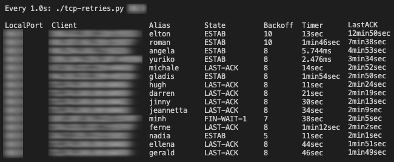

# TCP top

Just like `top`, but for TCP sockets.

## Requirements

Relies on the `ss` command to work, so only expect it to work on Linux. Other than that, you need Python 2.7, which should also be easily available.

## Download and install

    bash <(curl -s https://raw.githubusercontent.com/luciopaiva/tcptop/master/install.sh)

## retries.sh

Python script to list TCP clients having retransmission problems (from a Linux server standpoint). The scripts probes the `ss` command to obtain the data and then sorts connections by last ACK time, oldest first.

The script shows several fields (the screenshot above shows only a few), but the most important are:

- `LastACK`: elapsed time since the last ACK was received from that client (the table is sorted by this field)
- `Backoff`: I called this so because that's how `ss` calls it, but this is how many retransmissions (aka retries) have been tried since the last ACK was received from the client. By default, Linux retries 15 times before finally giving up on a connection
- `Timer`: how long until the current retransmission attempt times out. A timeout happens in case the ACK is not received. If that happens, the Backoff counter will increase by one and a new timer will begin

For descriptions about the other fields, check the source code.

The `Alias` column is just something to help the human eye track a connection as it moves up the table (we are not good at reading IPs).

How to run:

    ./retries.sh PORT

Where `PORT` is an optional port to filter the results. Pass nothing to have no filter applied.

## txbuffers.sh

Script to help identify sockets with largest the transmission buffers currently connected.

    ./txbuffers.sh PORT

## Acknowledgements

I am using a list of names taken from [this project](https://github.com/treyhunner/names) (license [here](https://github.com/treyhunner/names/blob/master/LICENSE.txt)).
